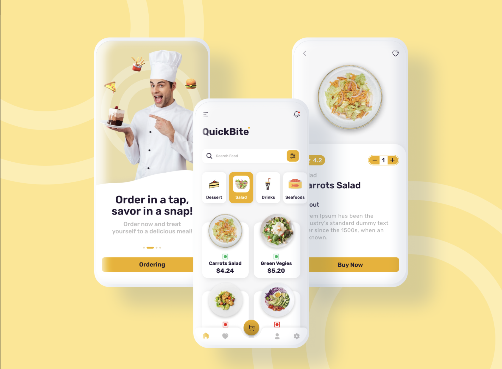
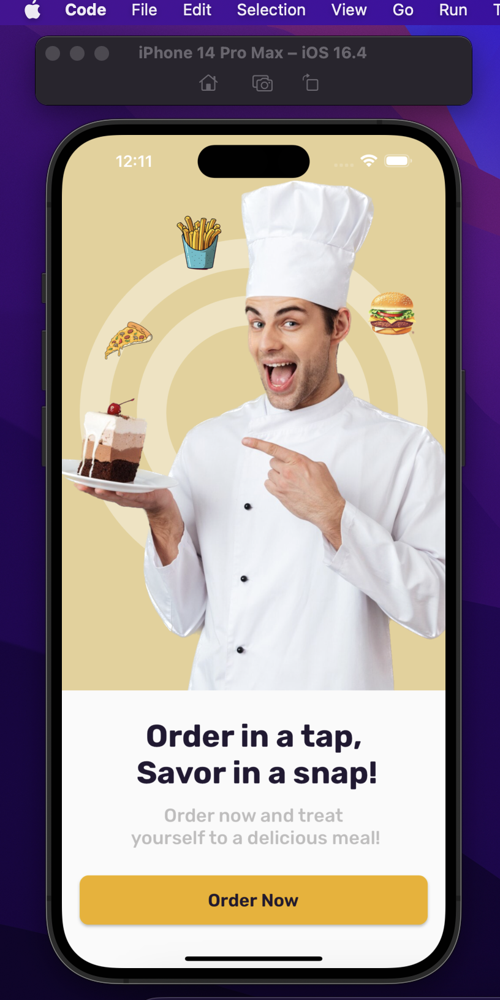
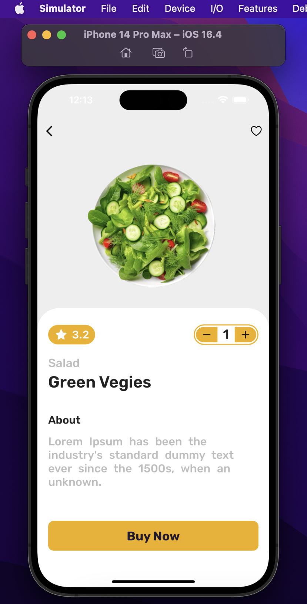

# QuickBite Delivery UI

A beautiful dribbble from design cheffed up with flutter.

# Getting Started

1. Make sure you have Flutter and Dart installed on your system.
2. Clone the repository and run the following commands:
     * flutter pub get
     * flutter run

# Screenshots

<h3>Dribble Design</h3>

  

<h3>Landing Page</h3>

  

<h3>Dashboard</h3>

  

<h3>Meal Details Page</h3>

  

# Contributing

Contributions are welcome! If you have any suggestions, bug reports, or feature requests, please open an issue or a pull request.
